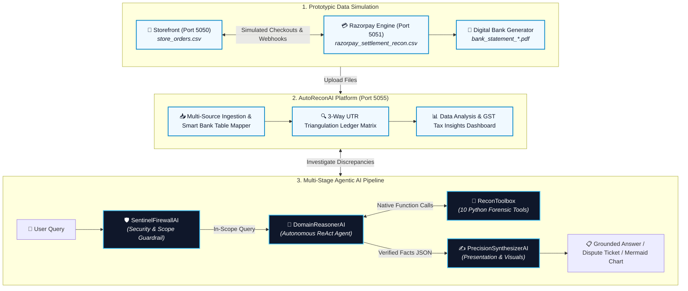

# ⚡ AutoReconAI - Reviewer Quick-Start & 5-Minute Demo Guide

[](https://www.python.org/)
[](https://flask.palletsprojects.com/)
[](https://ai.google.dev/)
[](https://www.chartjs.org/)
[](LICENSE)

> **A fast, reviewer-friendly guide to launching, testing, and understanding the AutoReconAI 3-way reconciliation prototype and agentic AI pipeline in under 5 minutes.**

---

## 📺 Video Demo Walkthrough

[](https://www.youtube.com/watch?v=YOUR_VIDEO_ID_HERE)

> 📹 **Watch the Full Video Walkthrough:** [Click here to view on YouTube](https://www.youtube.com/watch?v=YOUR_VIDEO_ID_HERE) *(Replace `YOUR_VIDEO_ID_HERE` with your recorded video link).*

---

## ⏱️ 60-Second Overview (Problem & Solution)

### The Problem
In high-volume e-commerce, transaction money moves asynchronously across three separate ledgers:
1. **Storefront (`store_orders.csv`):** Customer orders & checkout statuses.
2. **Payment Gateway (`razorpay_settlement_recon.csv`):** Deducts MDR fees, GST, and TDS before bundling daily payouts into lumped settlement UTRs.
3. **Commercial Bank (`bank_statement_*.pdf` / `.xlsx`):** Receives lump-sum settlement credits mixed with ordinary operational expenses (rent, utilities, wages).

When real-world failures happen (dropped webhooks, fee overcharges, prior-period refunds, chargeback holds), **manual reconciliation takes days of spreadsheet cross-referencing**, leading to delayed month-end closes and undetected fee leakage. Standard LLMs hallucinate financial arithmetic when given raw tabular data.

### The Solution: AutoReconAI
* **Realistic 2-System Simulation:** Simulates a live merchant store (Port 5050) and a Razorpay gateway engine (Port 5051) generating authentic CSV/PDF datasets with controlled commercial edge cases.
* **Automated 3-Way Triangulation (Port 5055):** Ingests and parses all 3 files, grouping transactions by daily settlement UTRs and isolating gateway payouts from general bank expenses.
* **Multi-Stage Agentic AI:** Uses an autonomous tool-calling agent (`DomainReasonerAI`) that queries deterministic Python verification tools (`ReconToolbox`) rather than guessing math, providing grounded explanations and auto-drafting dispute tickets.

---

## 🚀 Quick Setup & How to Run

### Step 1: Clone & Set Environment Variable
```bash
git clone https://github.com/Venukumar975/AutoReconAI.git
cd AutoReconAI

# Create a .env file at the root and add your Gemini API Key:
GEMINI_API_KEY=your_actual_gemini_api_key_here
```

### Step 2: Create Virtual Environment & Install Dependencies
```powershell
# Windows (PowerShell):
python -m venv venv
.\venv\Scripts\Activate.ps1
pip install -r requirements.txt
```

```bash
# macOS / Linux:
python3 -m venv venv
source venv/bin/activate
pip install -r requirements.txt
```

> 🌐 **Optional — Visual Browser Shopping Simulation:**  
> By default, the simulator runs in `super_fast` mode (pure Python HTTP API calls, generating 50+ orders in seconds with zero browser overhead). If you want to see a live visual browser where simulated customers add items to the cart, checkout, and pass through the Razorpay gateway prototype in Chromium, install Playwright:
> ```bash
> pip install playwright
> playwright install chromium
> ```

---

## ⚙️ Understanding `config.ini` (Simulation Controls)

The simulator is fully controlled via [`config.ini`](config.ini). We have structured the configuration into two logical sections:

### Section A: Baseline Simulation & Commercial Rates
```ini
[SIMULATION]
simulation_mode = super_fast
razorpay_transactions_count = 50
start_date = 2026-05-01
end_date = 2026-05-30
imputed_expenses_percentage = 20
bank_pdf_format = UNION_BANK
opening_balance = 25000.00

[CONTRACTED_RATES]
mdr_rate_percent = 2.0
gst_rate_percent = 18.0

[MERCHANT_TAX_PROFILE]
gstin = 36AATUF1234F1ZV
pan = ABCDE1234F
is_tds_applicable = yes
tds_rate_percent = 1
```

* **`simulation_mode`**: Selects execution engine — `super_fast` (instant API calls without browser), `fast` (accelerated Chromium browser window), or `normal` (human-like visual browsing).
* **`razorpay_transactions_count`**: Number of simulated customer orders to generate (supported range: 10 to 2000; default `50` for standard review).
* **`start_date` / `end_date`**: Calendar date window applied across store orders and bank statement timestamps.
* **`imputed_expenses_percentage`**: Adds realistic non-gateway operational business debits (rent, BESCOM bills, wages) into the bank statement (e.g. 20% adds 10 debits for 50 orders).
* **`bank_pdf_format`**: Chooses statement layout template (`UNION_BANK` for 7-column layout or `SBI` for 8-column landscape).
* **`opening_balance`**: Sets the opening bank ledger balance for calculating running bank balances.
* **`[CONTRACTED_RATES]`**: Defines the agreed merchant SLA baseline (e.g. `2.0%` MDR + `18.0%` GST) used by audit tools to detect rate overcharges.
* **`[MERCHANT_TAX_PROFILE]`**: Defines merchant credentials and statutory tax policy. You can leave this as-is; `is_tds_applicable = yes` with `tds_rate_percent = 1` enables prototypic statutory TDS deduction modeling.

---

### Section B: Prototypic Edge Cases & Anomaly Injection
```ini
[EDGE_CASES]
enable_edge_cases = true
dropped_webhook_count = 9
fee_overcharge_count = 5
orphan_refund_count = 10
chargeback_hold_count = 20
```

* **`enable_edge_cases`**: Master switch — `true` injects controlled commercial anomalies; `false` generates a 100% cleanly matched baseline.
* **`dropped_webhook_count`**: Number of random existing orders where payment is captured and settled in the bank, but the store order status remains `PENDING` due to simulated network packet drop.
* **`fee_overcharge_count`**: Number of random existing payments billed at inflated interchange rates (~2.75% vs. 2.0% contracted SLA) to test fee leakage recovery.
* **`orphan_refund_count`**: Number of prior-period customer return refund deductions injected into the settlement with non-reversed gateway processing fees.
* **`chargeback_hold_count`**: Number of random existing orders where customers raise a bank dispute, freezing order GMV and applying an administrative penalty (₹500 fee + ₹90 GST).

> 💡 **Prototypic Edge Case Modeling:** These edge cases are intentionally applied to random existing transactions as a prototypic simulation to model real-world payment gateway failure modes and test whether the 3-way reconciliation matrix and Agentic AI detect and resolve each scenario. All counts are fully configurable.

---

## 🧪 5 Prototypic Commercial Edge Cases

| # | Prototypic Edge Case | What Happens in the Simulation | The Manual Reconciliation Pain (Why CSVs/Excel Fail) | How the Agentic Pipeline Resolves It |
|:---|:---|:---|:---|:---|
| **1** | **Dropped Webhooks** | Payment is captured by gateway and settled to bank, but HTTP webhook drops, leaving store order status `PENDING`. | Accounting must cross-reference thousands of pending orders against settlement CSVs and bank credit lines row-by-row. In reality, merchants don't catch this, withholding customer packages indefinitely. | The agentic pipeline executes deterministic Python tools to check bank deposits against the settlement UTR and confirm the payment is safe to fulfill. |
| **2** | **MDR Fee Overcharges** | Gateway bills transaction at an inflated interchange rate (e.g. ~2.75%) exceeding contracted SLA (e.g. 2.00%). | Gateways lump hundreds of transactions into single net payouts. Calculating the exact fee percentage `(fee / billed_amount)` line-by-line against SLA terms is practically impossible in spreadsheets. | The agentic pipeline runs Python verification tools to calculate the exact fee rate breach and automatically drafts a formal dispute claim ticket. |
| **3** | **Orphan Customer Refunds** | Returns from prior billing cycles are debited from today's net payout with un-reversed gateway processing fees (MDR + GST). | The deduction appears in today's settlement, but has no matching order in today's store export. Finance teams waste hours hunting for "missing" orders and miss the non-refundable fee leakage. | The agentic pipeline executes Python analysis tools to trace prior-period refund IDs, calculate retained processing fees, and explain the deduction. |
| **4** | **Chargeback Dispute Holds** | Customer disputes transaction with bank; gateway freezes order GMV plus an administrative penalty (₹500 fee + ₹90 GST). | Banks enforce a strict 7-day window to contest disputes. In lumped statements, dispute debits are buried, causing merchants to miss the window and permanently lose both product and revenue. | The agentic pipeline runs Python auditing tools to isolate escrow holds and compile the transaction evidence needed to contest the chargeback. |
| **5** | **Statutory Tax Withholding** | Statutory tax deductions (e.g. Section 194-O TDS) withheld upfront by the payment gateway. | Bank deposits never match Gross Sales minus Fee, triggering false alarm "missing money" investigations by accountants unfamiliar with statutory withholding rules. | The agentic pipeline uses Python tax tools to verify statutory deductions and properly classify them as advance tax assets (Form 26AS). |

---

### Step 3: Launch Services & Run Data Simulation

> ⚠️ **Important on Config Changes:** Whenever you customize or edit settings in `config.ini`, **save the file (`Ctrl + S`)**. If your servers are already running, stop them (`Ctrl + C`), restart them, and re-run the simulation command below so that your new configuration takes effect.

Open **3 separate terminal windows** (ensure you activate your virtual environment `venv` in each terminal first):

```bash
# Terminal 1: Start Storefront Server (Port 5050)
.\venv\Scripts\Activate.ps1    # macOS/Linux: source venv/bin/activate
python backend.py 5050

# Terminal 2: Start Gateway Engine (Port 5051) & Recon Hub (Port 5055)
.\venv\Scripts\Activate.ps1    # macOS/Linux: source venv/bin/activate
python run_razorpay_suite.py

# Terminal 3: Run the Data Simulation Pipeline
.\venv\Scripts\Activate.ps1    # macOS/Linux: source venv/bin/activate
python "Data Simulator & Generator/run_simulation_pipeline.py"
```

> 💡 **Automatic DB Refresh & Overwrite:**  
> Running `run_simulation_pipeline.py` automatically resets `store.db` to a clean baseline catalog state and generates fresh files directly into the `generated_data/` folder:
> - `generated_data/store_orders.csv`
> - `generated_data/razorpay_settlement_recon.csv`
> - `generated_data/bank_statement_union_bank.pdf` (or `bank_statement_sbi.pdf` / `.xlsx`)
> 
> On every subsequent run, existing files in `generated_data/` are **completely overwritten with fresh data** (never appended to previous runs), so you never need to manually wipe files or re-seed tables.

---

## 🏗️ High-Level System & Pipeline Architecture



---

## 🖥️ AutoReconAI Platform Operations (`http://127.0.0.1:5055`)

Once simulation finishes, open `http://127.0.0.1:5055` to navigate the three core operations panels:

### 📁 Data Ingestion
Upload your three generated files using the sequential upload cards:
* **Store Orders (`generated_data/store_orders.csv`):** Ingests store checkout records and order statuses (`FULFILLED` vs `PENDING`).
* **Bank Statement (`generated_data/bank_statement_*.pdf`):** Ingests bank statements with an interactive column mapper that auto-detects and previews table headers.
* **Gateway Settlement (`generated_data/razorpay_settlement_recon.csv`):** Ingests gateway payout batches with MDR fee deductions, GST, TDS, and settlement UTRs.
* Click **"Proceed to 3-Way Reconciliation Matrix"** once all 3 files are uploaded.

---

### 🔍 3-Way Reconciliation
Visualizes the triangulated audit across all three financial sources:
* **Settlement UTR Batches:** Collates payments into expandable daily payout containers matching bank deposits.
* **Expense Isolation:** Separates non-gateway operational debits (rent, electricity, payroll) from payment gateway credits.
* **Audit Status Badges:** Instantly marks orders as **✅ Matched** (100% agreement) or **⚠️ Mismatched** (anomalies detected).

#### 🤖 6 Test Queries for Agentic AI Assistant
Click the floating **🤖 AI Copilot** button (bottom-right drawer) to test these 6 queries:

##### Standard Financial & Forensic Queries:
1. **Macro Financial Recovery Summary:**  
   > *"Provide a full financial recovery summary table of all mismatches grouped across all 5 edge cases."*
2. **Forensic Order Lifecycle Deep-Dive:**  
   > *"Explain what happened to ORD_1025 across the store, gateway, and bank."*
3. **MDR Overcharge Dispute Claim Email:**  
   > *"Draft a formal Razorpay Merchant Dispute Claim Ticket email for all fee overcharges found with settlement UTR evidence."*

##### Visual Chart & Diagram Queries (Mermaid Synthesis):
4. **Visual Loss Breakdown (Pie Chart):**  
   > *"Compare our financial losses across MDR fee overcharges, orphan refund fee leakages, and chargeback holds as a visual pie chart with root cause insights."*
5. **Contracted SLA vs. Billed Rate (Comparative Bar Chart):**  
   > *"Compare the effective fee rate charged by Razorpay on our overbilled orders against our contracted SLA as a visual comparative bar chart."*
6. **Dispute Contestation Procedure (Defense Flowchart):**  
   > *"Audit our customer dispute holds, list all affected customers with their order GMV in a table, and draw a visual step-by-step flowchart on how to contest them before the 7-day SLA expires."*

---

### 📊 Data Analysis & Insights
Provides high-level financial visualizations and statutory tax strategy:
* **11-Bar Settlement Allocation Chart:** Visualizes Gross GMV distribution across Net Bank Payout, MDR fees, GST, TDS, customer refunds, and chargeback holds via Chart.js.
* **Master Reconciliation Equation & Balance Badge:** Validates the live mathematical equation:
  $$\text{Net Bank Credit (Deposited Payout)} = \text{Gross Sales (GMV)} - (\text{Contracted MDR} + \text{Overcharged MDR}) - (\text{Contracted GST} + \text{Overcharged GST}) - \text{Statutory TDS} - (\text{Customer Refunds} + \text{Refund Fee Leakage}) - \text{Dispute Escrows} - \text{Dispute Penalties}$$
  Displays a dynamic `✅ 100% Mathematically Balanced` status badge upon verification.
* **Potential Realized Cash Upside:** Calculates total claimable overcharges and escrow funds to compute maximum post-recovery cash:
  $$\text{Potential Realized Bank Cash} = \text{Net Bank Credit Payout} + \text{Claimable Overcharges} + \text{Dispute Escrow GMV}$$
* **Statutory Tax & Recovery Summary:** Quantifies claimable GST Input Tax Credit (Section 16 CGST Act under GSTR-3B Table 4A) and provides executive financial guidance.

---

## ⚡ 5-Minute Reviewer Demo Walkthrough

Follow this fast path to experience the full end-to-end system in 5 minutes:

```
Step 1: 🧪 Run Simulation Pipeline
        └─ Command: python "Data Simulator & Generator/run_simulation_pipeline.py"
        └─ Output: Generates store_orders.csv, razorpay_settlement_recon.csv, and bank_statement_*.pdf

Step 2: 🌐 Open AutoReconAI Dashboard
        └─ URL: http://127.0.0.1:5055 in your browser
        └─ Verify: "Backend Connected" indicator (Port 5055 Online)

Step 3: 📁 Upload 3 Files in Data Ingestion Hub
        ├─ Card 1: Upload generated_data/store_orders.csv
        ├─ Card 2: Upload generated_data/bank_statement_union_bank.pdf (Confirm Column Mapper)
        ├─ Card 3: Upload generated_data/razorpay_settlement_recon.csv
        └─ Action: Click "Proceed to 3-Way Reconciliation Matrix"

Step 4: 🔍 Inspect 3-Way Reconciliation Matrix
        ├─ UTR Batches: Click to expand any settlement container (e.g. UTR2026...)
        ├─ Expense Separation: Observe non-gateway operational debits separated from payouts
        └─ Status Badges: Spot ⚠️ Mismatched anomalies alongside ✅ Matched orders

Step 5: 🤖 Test Multi-Stage Agentic AI Assistant
        ├─ Open: Click the floating 🤖 AI Copilot drawer button (bottom-right)
        └─ Action: Query the AI with any of the 6 test queries above

Step 6: 📊 Review Data Analysis & Insights
        ├─ Navigate: Click "📊 Data Analysis & Insights" in the sidebar
        ├─ Allocation Chart: Inspect the 11-bar breakdown of Gross GMV deductions
        └─ Master Equation: Check the ✅ 100% Mathematically Balanced status badge
```

---

## 📜 License
This project is open-source and licensed under the [MIT License](LICENSE).
