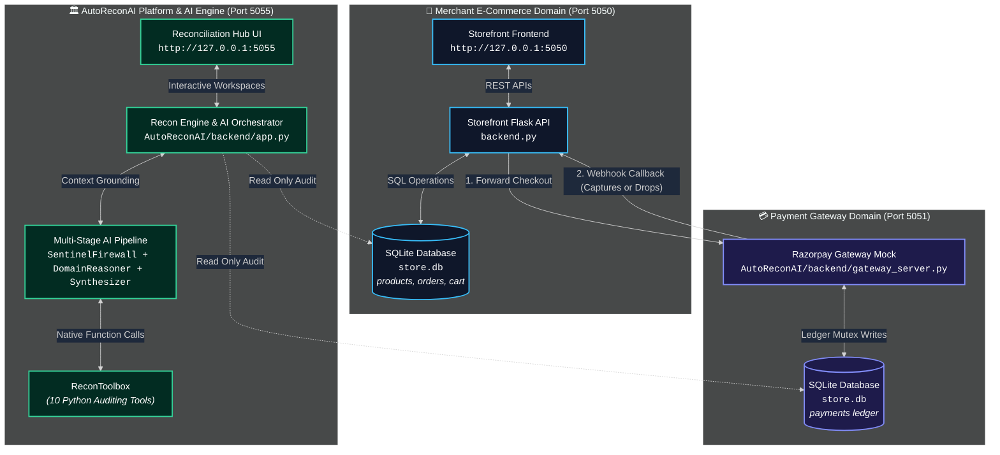
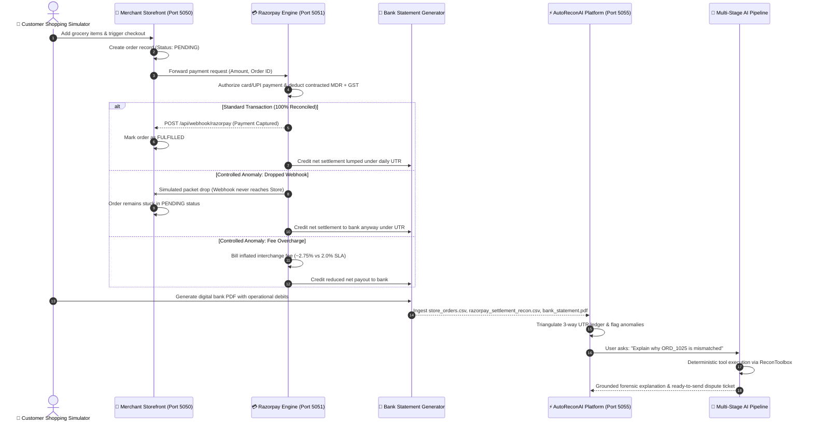

# 🏗️ System Architecture & Service Network

AutoReconAI operates as a multi-tier reconciliation ecosystem coordinating three isolated local service layers:

---

## 🌐 Port Map & Network Protocol

| Service Component | Port | Protocol | Primary Responsibilities |
|:---|:---|:---|:---|
| **Merchant Storefront (`FreshMart`)** | `5050` | HTTP / JSON | Product catalog browsing, cart operations, customer checkout sessions, and local order creation (`PENDING` -> `FULFILLED`). |
| **Razorpay Payment Engine Mock** | `5051` | HTTP / JSON | Payment authorization, webhook emissions, settlement UTR batch bundling, and fee/tax/TDS calculations. |
| **AutoReconAI Reconciliation Hub** | `5055` | HTTP / SSE / REST | 3-way reconciliation matrix, bank statement PDF parsing, Chart.js analytics dashboard, and the multi-stage agentic AI copilot. |

---

## 🔄 End-to-End Simulation Sequence

