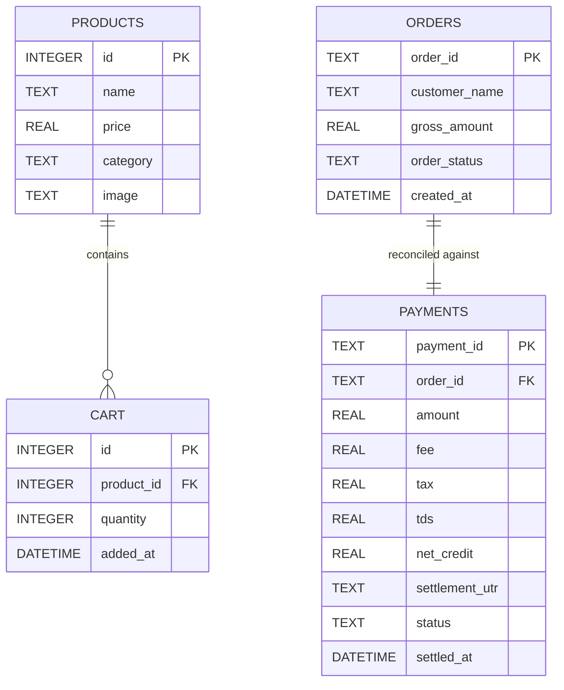

# 🗄️ Database Architecture & Schema Model (`store.db`)

AutoReconAI uses an embedded SQLite database (`store.db`) shared across local services with strict domain boundaries:
* **Storefront Service (Port 5050)** owns `products`, `orders`, and `cart`.
* **Razorpay Payment Gateway (Port 5051)** owns `payments`.



---

## 📋 Table Schema Reference

### `orders` Table (Merchant Storefront)
```sql
CREATE TABLE IF NOT EXISTS orders (
    order_id TEXT PRIMARY KEY,
    customer_name TEXT NOT NULL,
    gross_amount REAL NOT NULL,
    order_status TEXT NOT NULL,  -- 'FULFILLED' or 'PENDING'
    created_at DATETIME DEFAULT CURRENT_TIMESTAMP
);
```

### `payments` Table (Razorpay Payment Gateway)
```sql
CREATE TABLE IF NOT EXISTS payments (
    payment_id TEXT PRIMARY KEY,
    order_id TEXT NOT NULL,
    amount REAL NOT NULL,
    fee REAL NOT NULL,
    tax REAL NOT NULL,
    tds REAL DEFAULT 0.0,
    net_credit REAL NOT NULL,
    settlement_utr TEXT,
    status TEXT NOT NULL,  -- 'captured', 'refunded', 'disputed'
    settled_at DATETIME
);
```

---

## 🛠️ Standalone Database Utilities

> 💡 **Automatic Refresh:** Running `run_simulation_pipeline.py` automatically resets `store.db` to a clean baseline catalog state. Manual cleaning or seeding is optional.

### 1. View Tables in Terminal (ASCII Grid)
```bash
python database/view.py --console
```

### 2. View Tables in Desktop GUI Window (Interactive Grid)
```bash
python database/view.py --interface
```

### 3. Optional Standalone Re-seed or Clean Scripts
```bash
# Standalone wipe and seed grocery catalog:
python database/init_db.py

# Standalone wipe of all transaction records:
python database/clean_db.py
```
