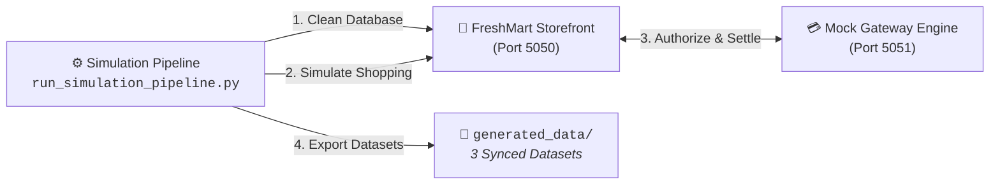

# 🧪 Prototypic Simulation Pipeline & Execution Guide

AutoReconAI includes an automated 2-system transaction simulator that creates realistic e-commerce purchase workflows across a merchant storefront and a mock Razorpay payment gateway.



---

## ⚡ Simulation Modes

Configured via `simulation_mode` in [`config.ini`](../config.ini):

1. **`super_fast` (Default & Recommended):**  
   Pure Python HTTP API requests using the standard library. Generates 50 to 500+ complete orders, webhook callbacks, settlements, and bank PDFs in seconds without launching a browser window.
2. **`fast`:**  
   Launches a visible Chromium browser via Playwright with fast-forward automated clicking through product catalogs, cart additions, and checkouts.
3. **`normal`:**  
   Launches Chromium with realistic human typing and shopping delays.

---

## 🚀 Running the Simulation Pipeline & Server Suite

To run the complete transaction simulation and generate fresh, synchronized reconciliation datasets, open **3 separate terminal windows** from the project root:

> ⚠️ **Important: Configuration Changes & Server Restarts**  
> Every time you modify settings in [`config.ini`](../config.ini) (such as changing transaction counts, varying opening balance, toggling edge cases, or adjusting MDR rates), you **must save the file (`Ctrl + S`)**, stop any active running servers (`Ctrl + C`), and restart them using the steps below. The servers and simulation pipeline read `config.ini` at startup, so restarting is required to reflect your changes.

### Terminal 1: Start Storefront Backend Server (Port 5050)
Runs the SQLite-backed FreshMart e-commerce storefront:
```powershell
# Windows PowerShell:
.\venv\Scripts\Activate.ps1
python backend.py 5050
```
```bash
# macOS / Linux:
source venv/bin/activate
python backend.py 5050
```

### Terminal 2: Start Razorpay Suite & AutoReconAI Platform (Ports 5051 & 5055)
Launches both the simulated mock Razorpay payment gateway (Port 5051) and the central AutoReconAI reconciliation dashboard (Port 5055):
```powershell
# Windows PowerShell:
.\venv\Scripts\Activate.ps1
python run_razorpay_suite.py
```
```bash
# macOS / Linux:
source venv/bin/activate
python run_razorpay_suite.py
```

### Terminal 3: Run the Data Simulation Pipeline
Executes checkout automation, injects commercial edge-case anomalies, and exports synchronized datasets:
```powershell
# Windows PowerShell:
.\venv\Scripts\Activate.ps1
python "Data Simulator & Generator/run_simulation_pipeline.py"
```
```bash
# macOS / Linux:
source venv/bin/activate
python "Data Simulator & Generator/run_simulation_pipeline.py"
```

> 💡 **For in-depth explanations and database schema mutations of the simulated commercial anomalies, see [`docs/edge_cases.md`](edge_cases.md).**

---

## 📁 Generated Datasets (`generated_data/`)

On every simulation run, files are output to `generated_data/` and cleanly overwritten:
* `store_orders.csv`: Storefront checkout records (`order_id`, `customer_name`, `gross_amount`, `order_status`, `created_at`).
* `razorpay_settlement_recon.csv`: Gateway settlement ledger (`payment_id`, `order_id`, `amount`, `fee`, `tax`, `tds`, `net_credit`, `settlement_utr`, `status`).
* `bank_statement_union_bank.pdf` (or `bank_statement_sbi.pdf` / `.xlsx`): Official digital bank statement containing settlement credits mixed with realistic operational debits (rent, BESCOM electricity, payroll).
