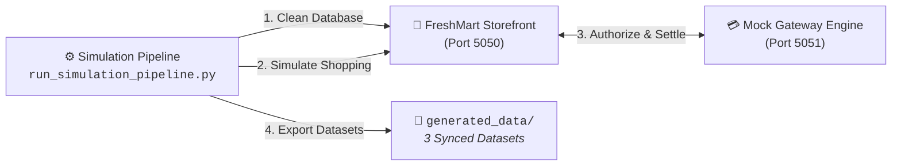

# 🧪 Prototypic Simulation Pipeline & Commercial Edge Cases

AutoReconAI includes an automated 2-system transaction simulator that creates realistic e-commerce purchase workflows across a merchant storefront and a mock Razorpay payment gateway.

---

## ⚡ Simulation Modes

Configured via `simulation_mode` in [`config.ini`](../config.ini):

1. **`super_fast` (Default & Recommended):**  
   Pure Python HTTP API requests using the standard library. Generates 50 to 500+ complete orders, webhook callbacks, settlements, and bank PDFs in seconds without launching a browser window.
2. **`fast`:**  
   Launches a visible Chromium browser via Playwright with fast-forward automated clicking through product catalogs, cart additions, and checkouts.
3. **`normal`:**  
   Launches Chromium with realistic human typing and shopping delays.

---

## 🔬 5 Prototypic Commercial Edge Cases

Our prototype models five realistic failure modes inspired by real-world merchant gateway operations:

### 1. Dropped Webhooks
* **What Happens:** Payment is captured by the gateway and settled to the bank, but the HTTP webhook callback to the merchant store drops due to simulated network packet loss.
* **Database State:** `payments.status = 'captured'` in gateway ledger, but `orders.order_status = 'PENDING'` in storefront database.
* **The Problem:** In high-volume environments, merchants withhold product fulfillment thinking payment failed, leading to customer complaints.
* **Agentic Resolution:** The agent checks bank credits against the settlement UTR and confirms the order is safe to fulfill.

### 2. MDR Fee Overcharges
* **What Happens:** Transactions are billed at an inflated interchange rate (~2.75%) exceeding the contracted commercial SLA (2.00%).
* **Database State:** `payments.fee` exceeds `payments.amount * contracted_mdr`.
* **The Problem:** Gateway settlements lump hundreds of orders into net payout totals, making subtle rate increases invisible without row-by-row fee calculations.
* **Agentic Resolution:** Audits billed fees against contracted rates in `config.ini`, calculates exact rupee leakage, and auto-drafts a formal dispute email with UTR evidence.

### 3. Orphan Customer Refunds
* **What Happens:** Customer returns from prior billing cycles are debited from today's net payout with non-reversed gateway processing fees (MDR + GST).
* **Database State:** Payout ledger contains negative amount rows referencing refund IDs without matching purchases in today's store orders.
* **The Problem:** Causes daily payout shortfalls and unrecoverable fee leakage.
* **Agentic Resolution:** Isolates prior-period refund IDs, quantifies the retained fee leakage, and advises booking the debit to Returns & Allowances.

### 4. Chargeback Dispute Holds
* **What Happens:** Customer disputes a transaction with their issuing bank; gateway freezes order GMV into escrow and applies an administrative penalty (₹500 fee + ₹90 GST).
* **Database State:** `payments.status = 'disputed'`, with dispute fee deductions recorded in the settlement ledger.
* **The Problem:** Banks enforce strict 7-day deadlines to contest disputes. Missed deadlines result in permanent loss of merchandise and funds.
* **Agentic Resolution:** Isolates escrow holds, quantifies recoverable GMV vs. lost penalty, and drafts a structured 7-Day Proof of Delivery (PoD) defense kit.

### 5. Statutory Tax Withholding (Section 194-O TDS)
* **What Happens:** Gateway withholds statutory tax upfront from the gross transaction value before settling funds to the bank.
* **Configuration:** Configured under `[MERCHANT_TAX_PROFILE]` (`is_tds_applicable = yes`, `tds_rate_percent = 1`).
* **The Problem:** Bank credits never equal gross GMV minus MDR, triggering false alarm "missing money" investigations by accountants unfamiliar with statutory withholding rules.
* **Agentic Resolution:** Suppresses false alarms, verifies tax withholding, and reconciles the deduction as an advance tax credit against Form 26AS.

---

## 📁 Generated Datasets (`generated_data/`)

On every simulation run, files are output to `generated_data/` and cleanly overwritten:
* `store_orders.csv`: Storefront checkout records (`order_id`, `customer_name`, `gross_amount`, `order_status`, `created_at`).
* `razorpay_settlement_recon.csv`: Gateway settlement ledger (`payment_id`, `order_id`, `amount`, `fee`, `tax`, `tds`, `net_credit`, `settlement_utr`, `status`).
* `bank_statement_union_bank.pdf` (or `bank_statement_sbi.pdf` / `.xlsx`): Official digital bank statement containing settlement credits mixed with realistic operational debits (rent, BESCOM electricity, payroll).
