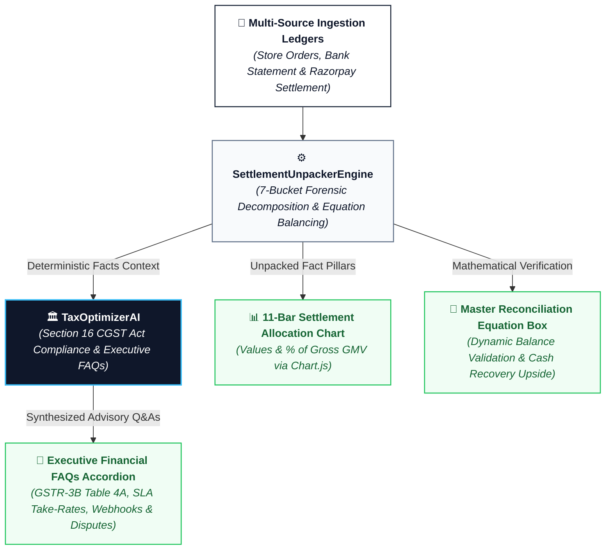

# 📊 Data Analysis & Tax Optimization Architecture (`TaxOptimizerAI`)

Navigating to the **📊 Data Analysis & Insights** tab in the sidebar unlocks an executive financial visualization dashboard powered by **Chart.js**, **`SettlementUnpackerEngine`**, and **`TaxOptimizerAI`** (Executive Tax Strategist & Financial Policy Evaluator):

### 🏗️ AI Analytics & Tax Optimization Flow Architecture:

### 🏛️ Role & Capabilities of `TaxOptimizerAI`:
- **Specialized Financial Policy Evaluator:** Unlike interactive chat agents, `TaxOptimizerAI` receives **100% verified deterministic metrics** and synthesizes executive guidance adhering to Indian statutory tax standards (CBDT / CBIC / RBI).
- **Core Advisory Pillars:**
  1. **Section 16 CGST Act Input Tax Credit (ITC):** Quantifies total 18% GST deducted on processing fees and provides precise reporting instructions for **monthly GSTR-3B filings (Table 4A - "All other ITC")** to reduce merchant net tax liability.
  2. **Gateway SLA Take-Rate Benchmarking:** Evaluates effective gateway take-rate vs. contracted commercial SLAs to identify rate leakage.
  3. **Dropped Webhook Fulfillment Safety:** Cross-checks gateway-settled funds against store `PENDING` states to safely authorize order fulfillment.
  4. **Immediate Overcharge Cash Recovery:** Pinpoints interchange rate breaches and drafts claimable amounts for gateway dispute tickets.

### 📊 Key Dashboard Modules & Executive Controls:

1. **Active Contracted SLA Header Badge:**
   - Displays current commercial baseline (e.g., `Contracted SLA: 2.00% MDR + 18% GST` or `2.50% MDR + 18% GST`).

2. **11-Bar Interactive Financial Settlement Allocation Chart (Chart.js):**
   - Displays exact INR values and dynamic `% of Gross Sales` tags for all 11 revenue/deduction components:
     - 🔵 **Gross Sales (GMV)** (Baseline checkout volume)
     - 🟢 **Net Bank Deposited** (Realized cash credited to bank)
     - 🟣 **Section 194-O Statutory TDS** (1.00% Form 26AS Advance Tax Asset)
     - 🟠 **Contracted Baseline MDR** vs. 🔴 **Overcharged MDR** (Claimable)
     - 🟣 **Claimable 18% GST (ITC)** vs. 🌸 **Overcharged GST** (Claimable)
     - 🌹 **Customer Return GMV** & 🥀 **Non-Recoverable Refund Fee Loss**
     - 🟧 **Chargeback Dispute Escrow Holds** & 🛑 **Dispute Penalties**

3. **Master Settlement Reconciliation Equation & Recovery Upside:**
   - Computes live formula:
     $$\text{Net Bank} = \text{GMV} - \sum \text{MDR} - \sum \text{GST} - \text{TDS} - \text{Refunds} - \text{Dispute Escrows}$$
   - **Real-Time Mathematical Balance Badge:** Displays `✅ 100% Mathematically Balanced` when variance is under ₹0.05.
   - **Potential Realized Cash Upside:** Quantifies total claimable fee overcharges and escrow funds to compute maximum post-recovery bank cash:
     $$\text{Potential Realized Bank Cash} = \text{Net Bank Payout} + \text{Claimable Overcharges} + \text{Dispute Escrow GMV}$$

4. **AI Controller Smart FAQs Accordion:**
   - Expandable Q&A accordion dynamically generated with tailored guidance for finance and tax operations teams.

---
